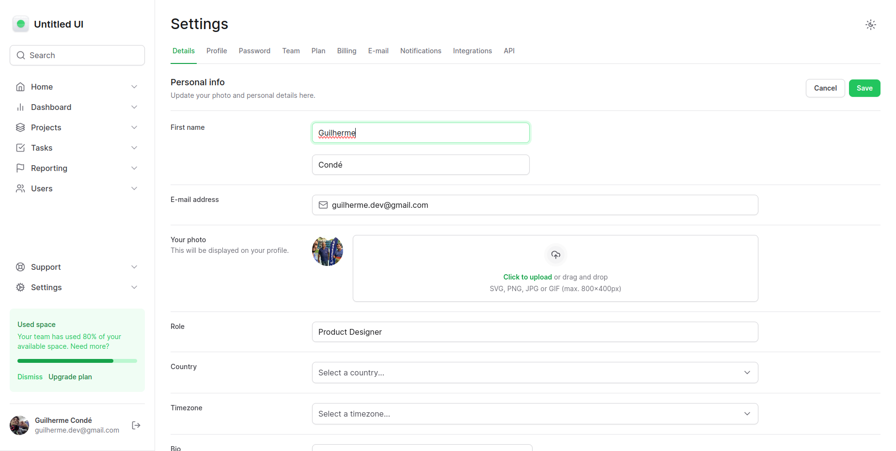
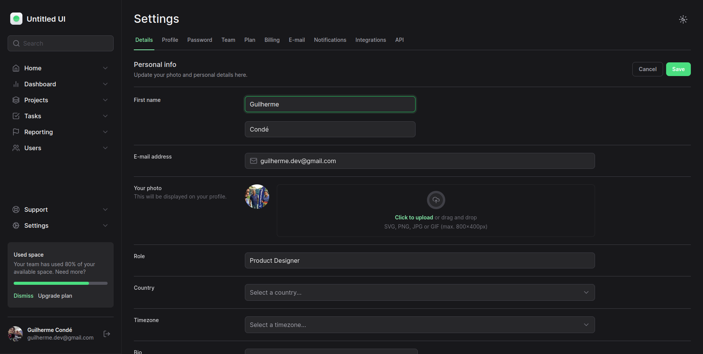

### 💻 Projeto

Aplicação para colocar em prática os conceitos do tailwindcss.

## ✨ Tecnologia

- [TypeScript](https://www.typescriptlang.org/)
- [React](https://reactjs.org/)
- [Tailwind](https://tailwindcss.com/)
- [Radix](https://www.radix-ui.com/)
- [Next](https://nextjs.org/)

## 🚀 Como executar

Em todos os projetos, ao acessar a pasta, é preciso baixar os pacotes com o gerenciador de sua preferencia.

## 🔖 Layout

Você pode visualizar o layout do projeto através do link abaixo:

- [Layout](https://www.figma.com/file/MU3H8HfTxX32ukt8ANpan7/Ignite-Tailwind?type=design&mode=design&t=QrqmbBAxzmp6nW5G-01)

Lembrando que você precisa ter uma conta no [Figma](http://figma.com/).

## 📝 License

Esse projeto está sob a licença MIT. Veja o arquivo [LICENSE](LICENSE) para mais detalhes.

## 🖼️ Imagens

